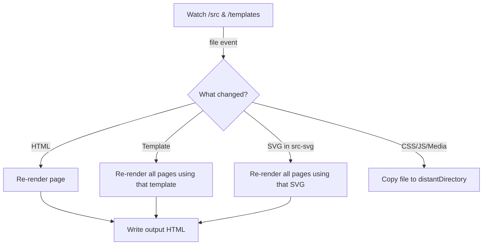

# 01 – Overview

> **Kobra Kreator** is a multi‑site, template‑driven static‑site generator written in Deno.
> It turns folders inside `/src/` into fully baked HTML/CSS/JS sites, ready to deploy
> to any conventional web host or CDN.

---

## What problem does it solve?

* **One repo, many domains** – Host any number of sites side‑by‑side in a single
  codebase.
* **No Node tool‑chain** – Runs on *pure* Deno; ships TypeScript support out of the box.
* **Rich templates without build‑time JS frameworks** – Use small, composable
  JS modules (`render()` functions) to generate headers, navigation bars and
  footers.
* **SVG super‑powers** – Author `<icon src="check.svg" />` and let Kobra
  inline the full SVG so you can style it with CSS or animate with JavaScript.
* **Instant feedback** – The built‑in watcher re‑renders or copies only what
  changed.

---

## Core concepts

| Term                  | Meaning                                                                                                             |
| --------------------- | ------------------------------------------------------------------------------------------------------------------- |
| **Site folder**       | A sub‑directory of `/src/` named after your domain (e.g. `my‑site.com`).                                            |
| **Template**          | A JS module under `/templates/{head,nav,footer}/` exporting `render({ frontMatter, links })` and returning HTML. |
| **Front‑matter**      | TOML metadata at the top of every HTML file, separated by `#---#`.                                                  |
| **`links.json`**      | Per‑site registry used by templates to build nav & footer menus.                                                    |
| **Distant directory** | Absolute output directory declared in each site’s `config.json`.                                                    |

---

## High‑level build flow

<!-- TODO: Decide if we want a PNG/SVG architecture diagram here instead of Mermaid. -->

---

## Feature matrix

| Capability             | Supported?                           | Notes                                                               |
| ---------------------- | ------------------------------------ | ------------------------------------------------------------------- |
| Multiple sites         | ✅                                    | Folders in `/src/`.                                                 |
| Hot‑reload watch       | ✅                                    | Uses `Deno.watchFs`. Debounce strategy described in 09‑watch‑rules. |
| Custom head/footer/nav | ✅                                    | Via template modules.                                               |
| Arbitrary page scripts | ✅                                    | `scripts.modules` & `scripts.inline` front‑matter arrays.           |
| Markdown pages         | <!-- TODO: confirm future plan --> ❌ | Currently HTML‑only.                                                |

---

## Roadmap ⏩

1. **Plugin system** – Allow custom build steps. <!-- TODO: move to separate RFC once designed -->
2. **Markdown → HTML converter** for blog workflows.
3. **i18n routing** – Compile language variants per page.

---

### Where to next?

* **Directory layout:** see [02‑directory‑layout](02-directory-layout.md)
* **Special SVG tags:** see [03‑special‑svg‑tags](03-special-svg-tags.md)
* **Full front‑matter reference:** see [04‑front‑matter](04-front-matter.md)

*(Docs index lives in the project **README**.)*

