# 06 – Rendering Pipeline

This chapter walks through **how a single page travels** from raw source file to
finished HTML inside its `distantDirectory`. It also shows how the pipeline
reacts to file‑system events raised by the watcher.

> For FS event semantics, see **09-watch-rules**. For asset copying, see
> **10-file-copy-rules**.

---

## 1. High‑level flow

```mermaid
%% TODO: replace with an SVG once the diagram is final
%%{init: {'flowchart': {'htmlLabels': false}}}%%
flowchart TD
    E[FS event] --> |HTML page changed| P1[Render‑Page]
    E --> |Template changed| P2[Render‑All‑Using‑Template]
    E --> |SVG in src-svg changed| P3[Render‑All‑Using‑SVG]
    E --> |Asset changed| AC[Copy File]

    subgraph Rendering
      PARSE[1. Parse front-matter & HTML]
      CONVERT[2. Run converters]
      LINKS[3. Update links.json]
      HEAD[4. Apply head template]
      NAV[5. Apply nav template]
      FOOT[6. Apply footer template]
      SCRIPTS[7. Inject scripts & styles]
      ASSEMBLE[8. Stitch fragments + page content]
      REPLACE[9. Inline <icon>/<logo>]
      WRITE[10. Write output to distantDirectory]
      PARSE --> CONVERT --> LINKS --> HEAD --> NAV --> FOOT --> SCRIPTS --> ASSEMBLE --> REPLACE --> WRITE
    end
```

---

## 2. Detailed steps

### 2.1 Parse front‑matter & HTML

- Use [`TOMLParser`](https://deno.land/std/toml) to convert the header into an
  object.
- HTML section is loaded into
  [https://deno.land/x/deno\_dom](https://deno.land/x/deno_dom)’s `DOMParser`
  for subsequent manipulations.

### 2.2 Run converters

- Source files can register converters based on file extension.
- Use `registerConverter(ext, fn)` to register a converter where `ext` is like
  `.md` and `fn` receives `(path, content)`.
- Call `convert(path, content)` to transform the raw text. If no converter is
  found, the original string is returned.
- Built‑in plugins under `/plugins` provide Markdown and JSON examples.

### 2.3 Update `links.json`

- If the page’s front‑matter contains **any** `links.*` keys, merge them into
  the site’s `links.json`.
- **Deduplication** – Two identical `href`/`label` pairs are collapsed if from
  the same source file. Else an error is thrown.
- The file is written back **only if** its in‑memory representation changed to
  avoid spurious disk writes.
- When a page modifies the navigation data, all other pages declaring
  `[links]` are automatically re-rendered so templates see the latest
  information.
- `links.json` is **auto‑managed**; manual edits are ignored and will be
  overwritten on the next page render.

### 2.4 Apply templates

- Resolve file path: `templates/<slot>/<name>.js`.
- Import (cached by Deno) and call `render({ frontMatter, links })`.
- For _head_: returned HTML is **prepended** inside a fresh `<head>` element.
- For _nav_ / _footer_: returned fragment is inserted **before** the content and
  **after** it respectively.

### 2.5 Inject styles & scripts

1. **CSS list** – Each entry becomes `<link rel="stylesheet" href="…">` inside
   `<head>`.
2. **Module scripts** – Output `` and placed just before `</body>`.

   <!-- TODO: flag to allow `defer` scripts in head? -->

### 2.6 Assemble & inline SVGs

- Combine head, nav, page content, footer, scripts into a DOM tree.
- Replace each `<icon>` / `<logo>` node with SVG markup pulled from `src-svg/`.
- Remove unused whitespace if `--minify` flag is passed.
  <!-- TODO: implement minify option -->

### 2.7 Write output

- Compute destination: `<distantDirectory>/<relative/path/of/page>.html`
  (Markdown sources are converted to `.html`).
- Ensure folders exist (`Deno.mkdir({ recursive: true })`).
- Write file with UTF‑8 encoding.

---

## 3. Dependency graph & smart invalidation

To avoid re‑rendering _every_ page on every change, Kobra Kreator maintains a
**dependency map** at runtime:

| Dependency              | Recorded as                                   |
| ----------------------- | --------------------------------------------- |
| Page → template(s)      | `pageDeps.templates = ["head/default", …]`    |
| Page → SVG(s) used      | `pageDeps.svgs     = ["ui/check.svg", …]`     |
| Page → inline script(s) | `pageDeps.scripts  = ["inline.inline.js", …]` |

- When a template changes, only pages whose `pageDeps.templates` contains that
  template are re‑rendered.
- When a file inside `src-svg/` changes, only pages referencing that SVG are
  re‑rendered.
- When an inline script file changes, only pages referencing that script are
  re‑rendered.

<!-- TODO: persist dependency map to disk to speed up cold start. -->

---

## 4. Concurrency model

- Rendering tasks are queued and run in **N worker threads** (default
  `N =
  number of CPU cores`) using Deno’s worker API.
- Each worker is **stateless**; the main thread coordinates disk writes to avoid
  race conditions on `links.json`.

<!-- TODO: benchmark worker spawn cost vs. simple async pool. -->

---

## 5. Error strategy

| Failure type          | Behaviour                                                                                 |
| --------------------- | ----------------------------------------------------------------------------------------- |
| Missing template file | Build **fails fast** with clear path in error.                                            |
| Bad front‑matter TOML | Build fails for that page; other pages continue. <!-- TODO: confirm continue vs stop. --> |
| I/O error on write    | Build aborts; watcher stays alive and retries on next save.                               |

Errors are logged to stderr in **red** with file path and line number when
available.

---

## 6. CLI flags (planned)

- `--minify` – Collapse whitespace & inline `<style>`/`<script>` where possible.
- `--verbose` – Extra timing info per stage.
- `--workers=<n>` – Override default worker count.

<!-- TODO: update once the CLI is implemented in `main.js`. -->

---

### Next → [07-config-schema](07-config-schema.md)
